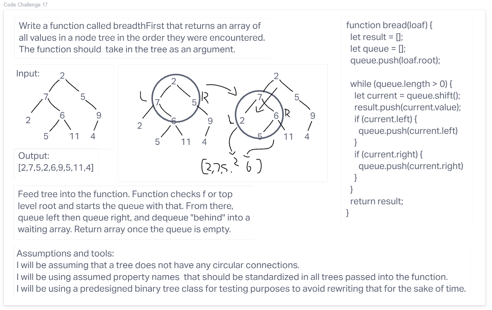

# Breadth-first traversal

## Challenge 17

Write a function called breadthFirst that returns an array of all values in a node tree in the order they were encountered. The function should  take in the tree as an argument.

## Approach & Efficiency

This was explained very clearly by JD and helps establish more recursive thinking in my head. Thank you JD! The approach shown in class is exceptionally clean and I struggled to improve upon it outside just translating it to JavaScript. I cannot even think of how to shrink it down to fewer lines.

